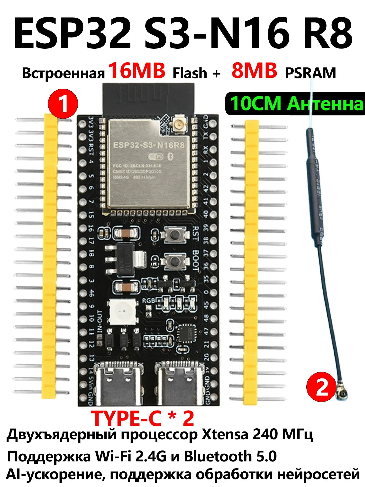

# Radex MR107ion → ESP32 → Home Assistant / Web UI

Готовая ESPHome-прошивка, которая превращает ESP32-плату в **постоянный BLE-шлюз**
между радон-детектором **Radex MR107ion** (Quarta-Rad, [quartarad.com](https://quartarad.com))
и вашим домом. Прибор перестаёт зависеть от приложения **RadexM** на телефоне —
пока ESP32 стоит у розетки, данные текут 24/7 без облака изготовителя.

```
Radex MR107ion ─BLE READ-poll─► ESP32 ─Web UI v3─► браузер
                                  │
                                  ├─► ESPHome API ─► Home Assistant
                                  │
                                  └─► Народмон (инфраструктура есть, ВЫКЛ по умолчанию)
```

Полная база знаний — в [`SKILL.md`](SKILL.md). Полная BLE-расшифровка — в
[`references/mr107ion.md`](references/mr107ion.md).

---

## С чего начать

Всё дальнейшее зависит от того, какая у вас плата. Найдите свою строку.



| Ваша плата | Что делать |
|---|---|
| **ESP32-S3-DevKitC-1 N16R8** — 16 МБ Flash, 8 МБ PSRAM (на снимке справа; маркировка написана прямо на модуле) | Собирать ничего не нужно. Возьмите готовый образ `firmware.factory.bin` из [релиза](https://github.com/VibeEngineering-LLC/radex-esp32/releases/latest) и залейте [прошивальщиком](https://github.com/VibeEngineering-LLC/atomspectra-waterfall-esp32-flasher). Порядок — сразу ниже |
| Другая плата на ESP32-S3 (4 или 8 МБ, без PSRAM) | Готовый образ не подойдёт — он рассчитан на 16 МБ флеша. Соберите `firmware/radex_gateway_s3.yaml` сами, см. [INSTALL.md](INSTALL.md) |
| Классическая ESP32-DevKitC на WROOM-32 | Соберите `firmware/radex_gateway.yaml`, см. [INSTALL.md](INSTALL.md) |

Где купить подходящую плату, если её ещё нет: например, [Ozon](https://ozon.ru/t/V2qn1g2)
(ищите в названии именно «**N16R8**» — это и есть 16 МБ флеша плюс 8 МБ PSRAM).

### Быстрый старт на плате N16R8 — от коробки до графика

1. **Залейте образ.** Прошивальщик сам скачает `firmware.factory.bin` из релиза. Плате
   нужен один кабель USB-C. На плате **два разъёма**, и порт в системе появляется только
   от одного из них — если плата не определилась, переткните кабель во второй
   (подробнее — в [INSTALL.md](INSTALL.md)).
2. **Подключитесь к плате по Wi-Fi.** Своей сети она пока не знает, поэтому поднимает
   собственную точку доступа **`radex-gw-s3 Fallback`**, пароль **`radex123`**.
   Подключитесь к ней с телефона или ноутбука.
3. **Укажите домашнюю сеть.** Откроется страница настройки (если не открылась сама —
   зайдите на `http://192.168.4.1`). Выберите свою сеть **2,4 ГГц**, введите её пароль.
   Плата перезагрузится и уйдёт в вашу сеть — её точка доступа больше не появится.
4. **Откройте веб-страницу платы** — это и есть весь интерфейс шлюза:
   → **`http://radex-gw-s3.local/`**
   Не открывается — значит в вашей сети не работает mDNS. Тогда посмотрите IP-адрес
   платы в списке клиентов роутера и откройте `http://<этот-адрес>/`.
5. **Введите логин и пароль.** Для готового образа из релиза это **`radex`** и
   **`radex`**. Если собирали прошивку сами — те значения, которые вы вписали в свой
   `secrets.yaml` в ключи `web_server_auth_user` и `web_server_auth_pass`.
6. **Включите Radex MR107ion рядом с платой.** Адрес прибора вводить не нужно — плата
   находит его в эфире сама. В группе «Сервис» появится поле «Найденный прибор Radex» с
   адресом, в группе «Данные» — радон, температура и влажность. Если приборов рядом
   несколько и нужен конкретный, впишите его адрес в поле
   «MAC Radex (AA:BB:CC:DD:EE:FF)» и нажмите «Применить MAC и перезагрузить».

Выгрузка на Народмон выключена и включается только вручную.

Логин и пароль готового образа одинаковы у всех, кто его залил: образ общий, и они лежат
открыто в [`firmware/secrets.public.yaml`](firmware/secrets.public.yaml). Это не
оплошность, а плата за то, что образ не нужно пересобирать. Кому нужны свои значения —
вписывает их в `secrets.yaml` и собирает прошивку сам; заодно можно сразу указать там
домашнюю сеть, и тогда шаги 2–3 не понадобятся вовсе.

---

## ⚠ Перед использованием

Шлюз подключается к прибору Radex MR107ion по Bluetooth Low Energy и **только читает**
данные (BLE READ-poll по ATT-handle) — команд записи на прибор не шлёт, накопленные
показания и настройки прибора не меняет. Риск для самого прибора минимален.
Прошивка/OTA относится к плате ESP32; прерывание прошивки может потребовать повторной
заливки платы через USB.

## Отказ от ответственности

Прошивка предоставляется «как есть», без каких-либо гарантий. Автор не несёт
ответственности за любой прямой или косвенный ущерб: потерю данных, неработоспособность
прибора или платы, иные последствия использования. Используя прошивку, вы принимаете
эти условия и действуете на свой страх и риск.

---

## Какая прошивка для какой платы

В скилле — **пять YAML** на одной кодовой базе. Различия: целевой ESP32-модуль,
сценарий применения, Web UI layout.

| Прошивка | Целевая плата | Что особенного | Когда выбирать |
|---|---|---|---|
| **`firmware/radex_gateway_s3_n16r8.yaml`** *(рекомендуемая, 2026-08-20)* | **ESP32-S3-DevKitC-1 N16R8** (16 МБ Flash, 8 МБ PSRAM octal), framework=arduino | Профиль платы задан явно: `flash_size: 16MB` + блок `psram: {mode: octal, speed: 80MHz}`. MAC прибора в прошивку **не зашит** — плата сама ищет Radex в эфире по имени (начинается на `MR107` или `Radex`, регистр не важен) или по UUID сервиса `FE651700-…` (принимаются оба варианта последнего байта — `…8AAA` и `…8AAB`) и запоминает найденный адрес вместе с типом адреса в NVS. Ручной ввод MAC через Web UI сохранён и имеет приоритет. В Web UI добавлены поле «Найденный прибор Radex», кнопка «Забыть прибор и искать заново», датчики «Свободная память» и «Свободная PSRAM». `api:` без ключа шифрования (сборка публичная), Web UI закрыт Basic Auth | Новая установка на плату N16R8. Единственный вариант, который можно поставить **готовым бинарником без пересборки** — в том числе через прошивальщик (см. ниже) |
| **`firmware/radex_gateway_s3.yaml`** *(актуальная, 2026-06-17)* | **ESP32-S3-DevKitC-1** (`board: esp32-s3-devkitc-1`, framework=arduino) | BLE-клиент к 1×MR107ion, Web Server v3 + Basic Auth + sorting_groups (Data / Service), ESPHome API encryption, watchdog WiFi, Народмон-инфраструктура (switch ALWAYS_OFF, 4 протокола), USB-C, 4 параллельных BLE-слота | Готовый production-шлюз для **одного** MR107ion, если вы собираете прошивку сами. Два ограничения: MAC прибора нужен уже на этапе компиляции (`ble_client.mac_address` — обязательное поле схемы), а профиль памяти платы не задан — ESPHome берёт дефолтные 4 МБ флеша и PSRAM не включает |
| `firmware/radex_gateway_s3_baseline.yaml` | ESP32-S3-DevKitC-1 | Чистый baseline без сенсоров (BLE/API/Web UI без логики опроса) — для проверки железа и OTA | Первая прошивка новой платы S3 (smoke-тест перед накатом полной прошивки) |
| `firmware/radex_gateway.yaml` | ESP32-DevKitC (WROOM-32 / WROVER), framework=esp-idf | v0.3.0-step8 (последний шаг — `bluetooth_proxy` закомментирован), BLE READ-poll 4 handle round-robin, две таблицы Web UI v3 («Данные» / «Сервис»), `web_server.log: false` против json:111 | Старая плата ESP32-DevKitC, ESP-IDF |
| `firmware/radex_gateway_v2.yaml` | ESP32-DevKitC | Альтернатива на Web Server v2 (одна плоская таблица с тематическими префиксами `1.x` / `2.x` / `3.x` / `4.x`) | Нужен «всё разом» без переключения групп |

Все прошивки слушают тот же протокол MR107ion (custom service `FE651Y00-…`, READ-poll
ATT-handle через бэкбон `FE651700-…`), различаются только UI / стек / HARD-правила.

### Установка без пересборки — через прошивальщик

Для `radex_gateway_s3_n16r8.yaml` в релизах этого репозитория лежит готовый образ
`firmware.factory.bin`. Его умеет заливать
[прошивальщик](https://github.com/VibeEngineering-LLC/atomspectra-waterfall-esp32-flasher) —
он сам скачивает ассет из релиза и пишет его на плату. Ни Python, ни ESPHome, ни правки
YAML для этого не нужны.

Дальше по шагам:

1. Залить образ на плату.
2. Плата ищет сеть `radex-gw-setup`. Такой сети не существует — это сделано намеренно,
   поэтому плата поднимает свою точку доступа **`radex-gw-s3 Fallback`** с паролем
   `radex123`.
3. Подключиться к этой точке с телефона или ноутбука, в captive portal выбрать свою
   Wi-Fi 2.4 ГГц и ввести её пароль. Плата перезагрузится и уйдёт в вашу сеть.
4. Открыть `http://radex-gw-s3.local/`, логин `radex`, пароль `radex`.
5. MAC прибора вводить не нужно: плата находит Radex в эфире сама и запоминает его.
   В группе «Сервис» появится поле «Найденный прибор Radex» с адресом, в группе
   «Данные» — радон, температура и влажность.

На проверке прошивка нашла прибор Radex MR107ion в течение минуты после старта и стала
отдавать показания. Адрес прибора и тип адреса сохраняются в NVS, чтобы после
перезагрузки не ждать эфира. Сам тип адреса ESPHome восстанавливает и без этого —
при обнаружении прибора в рекламе (`parse_device()`), — так что хранение типа здесь
подстраховка, а не обязательное условие работы.

**Пароли из этого списка опубликованы и потому секретом не являются** — они лежат в
`firmware/secrets.public.yaml`, с которым собран публичный бинарник. Пока плата стоит в
режиме настройки, к её точке доступа может подключиться любой, кто рядом. Тому, кого это
не устраивает, нужно собрать прошивку самому: скопировать `secrets.public.yaml` в
`secrets.yaml`, вписать свои значения `ap_password`, `ota_password`,
`web_server_auth_user` / `web_server_auth_pass` и пересобрать. Если в `secrets.yaml`
сразу указать свою домашнюю сеть, плата подключится к ней при первом старте и точку
доступа поднимать не станет.

---

## Альтернативная архитектура: чистый ESP-IDF (v1.0.0)

Пять прошивок выше собраны на ESPHome. В [`firmware-idf/`](firmware-idf/) лежит
независимая ветка того же шлюза — написанная на C напрямую поверх ESP-IDF, без
ESPHome как прослойки. Причина перехода — контроль над BLE-стеком: часть
поведения контроллера (выбор LEGACY- или EXTENDED-варианта команды соединения,
`esp_ble_gattc_open()`) ESPHome не экспонирует в конфигурацию, а именно в этом
месте лежал корневой дефект переподключения (разбор — в
[`KNOWN_ISSUES.md`](KNOWN_ISSUES.md), `INC-BLE50-001`). На ESP-IDF sdkconfig
управляет фичесетом Bluedroid напрямую, и дефект устраняется отключением набора
функций BLE 5.0, а не обходом симптома.

Отличия от ESPHome-веток, помимо языка реализации:

- **Рациональный критерий оценки соответствия по НРБ-99/2009** — отдельная
  вкладка Web UI: выбор норматива (200 или 400 Бк/м³), формула суммарной
  неопределённости, заключение о соответствии, синхронизированное между
  вкладками «Показания» и «Рациональный метод». Методика Цапалова —
  публикуется вместе с прошивкой (`references/`).
- **Watchdog** — резервная линия защиты независимо от корневого BLE-фикса:
  серия подряд неудачных попыток открытия соединения приводит к программной
  перезагрузке (`esp_restart()`).
- **Кнопка программной перезагрузки** в Web UI — отдельно от watchdog, по
  запросу оператора платы.
- Множество вкладок вместо одной плоской таблицы, полноэкранный график с
  hover-подсказкой, адаптация раскладки под мобильный экран.

Готовый образ для платы ESP32-S3-DevKitC-1 N16R8 — в
[релизе v1.0.0](https://github.com/VibeEngineering-LLC/radex-esp32/releases/tag/v1.0.0):
`radex-gw-idf-v1.0.0-factory.bin` (полный образ, заливать на `0x0`) и
`radex-gw-idf-v1.0.0-app.bin` (только приложение, для платы с уже установленным
загрузчиком, заливать на `0x20000`). Контроль целостности — `sha256sums.txt`
в том же релизе.

Сборка — через Docker-образ `espressif/idf:v6.1` (среда фиксирована версией,
не системной установкой ESP-IDF):

```bash
docker run --rm -v "${PWD}/firmware-idf:/project" -w /project \
  espressif/idf:v6.1 bash /project/build.sh
```

На Windows — обёртка `firmware-idf/build.ps1` (решает проблему кириллицы в
пути проекта, которую Git Bash подменяет). Перед первой сборкой скопировать
`firmware-idf/main/secrets_local.h.example` в `secrets_local.h` и вписать
свою сеть — файл в репозиторий не попадает (`.gitignore`).

Площадка **не** заменяет пять ESPHome-прошивок выше — они остаются
рекомендованным путём для тех, кому не нужен BLE-фикс или рациональный метод.
Для платы ESP32-S3 N16R8 обе ветки взаимозаменяемы по железу; выбор — по
набору нужных функций.

---

## Что измеряется

Прошивка циклически опрашивает **4 BLE-handle** прибора (round-robin, 4.3 с между read'ами,
полный цикл ≈ 17.2 с) и публикует следующий набор сенсоров в Web UI:

| Метрика | Единицы | Источник на приборе | ESPHome sensor |
|---|---|---|---|
| Метрика | Единицы | Источник на приборе | ESPHome sensor | Где есть |
|---|---|---|---|---|
| **Радон последний** | Bq/m³ | float32 LE @ handle `0x0049` (`OAR_last`) | `radon_bqm3` | все 3 YAML |
| **Радон среднее (прибор)** | Bq/m³ | float32 LE @ handle `0x0040` (`OAR_sred`) | `radon_avg_bqm3` | все 3 YAML |
| **Радон среднее за час** | Bq/m³ | sliding_window 60 × 60 c, `filter_out: nan` | `radon_avg_hour` | только `radex_gateway_s3.yaml` |
| **Радон среднее за день** | Bq/m³ | sliding_window 1440 × 60 c, `filter_out: nan` | `radon_avg_day` | только `radex_gateway_s3.yaml` |
| **Температура** | °C | int16 LE @ handle `0x0058` (`temper_x10`), декод `÷10` | `temperature_c` | все 3 YAML |
| **Влажность** | % | uint8 @ handle `0x005E` (`humidity`) | `humidity_pct` | все 3 YAML |
| **RSSI BLE** | dBm | из advertise-пакетов (`on_ble_advertise`) | `rssi_radex` | только `radex_gateway_s3.yaml` |

Полная карта 15 характеристик сервиса `FE651700-…` (включая `Sko_OAR_sred`, `OAR_min/max`,
`OAR_mov_avr`, `t_izm_last`) — в разделе «Полная расшифровка BLE-протокола» ниже и в
[`references/mr107ion.md`](references/mr107ion.md).

> Радон — интегральная статистика по минутным окнам внутри прибора (ионизационная камера
> накапливает счёт за ≥1 мин). Поэтому period опроса 4.3 с — это плотность ради UI-плавности
> и точного скользящего окна на стороне ESPHome, а не из-за физики измерения. Для
> standalone-клиентов 30–60 с — разумный практичный дефолт.

---

## Поддерживаемые приборы

| Прибор | Что измеряет | BLE | Готовая прошивка |
|---|---|---|---|
| **Radex MR107ion** | Радон в воздухе (Bq/m³, ионизационная камера) + температура + влажность | ✅ | `firmware/radex_gateway_s3.yaml` (актуальная) |
| Radex RD1212-BT | Гамма-фон (мощность дозы, Geiger-счётчик) | ✅ | планируется после реверса протокола |
| Radex One | Гамма-фон | ❌ USB-only | вне скилла (BLE-шлюз не применим) |

Линейка определяется через единое приложение производителя **RadexM**
([Android](https://play.google.com/store/apps/details?id=ru.quartarad.radexm),
[iOS](https://apps.apple.com/us/app/radexm/id1524841479)). Все BLE-приборы
используют один шаблон GATT-сервисов (`FE651Y00-…`).

---

## Что НЕ нужно для запуска

- ❌ Учётная запись Quarta-Rad / привязка к облаку
- ❌ Постоянно работающий смартфон рядом с прибором
- ❌ Pairing / bonding (Radex не требует)
- ❌ Платное ПО

## Что нужно

| Что | Зачем |
|---|---|
| ESP32-S3-DevKitC-1 **N16R8** *(актуальная плата)* | мозг шлюза, USB-C. 16 МБ флеша и 8 МБ PSRAM — то, подо что собрана прошивка. Пример: [Ozon](https://ozon.ru/t/V2qn1g2) |
| USB Type-C кабель | прошивка и питание |
| Radex MR107ion с BLE | источник данных |
| Wi-Fi 2.4 ГГц + интернет | для Home Assistant / Web UI |
| `esphome` 2026.5+ на ПК | `pip install esphome` |
| Адрес BLE-прибора (MAC) | не нужен: прошивка находит прибор в эфире сама. Понадобится, только если рядом несколько приборов Radex и нужен конкретный |

---

## Развёртывание (5 минут)

> Здесь — короткая шпаргалка для тех, у кого уже стоит ESPHome и PlatformIO кэш прогрет.
> **Полная пошаговая инструкция с нуля** (требования к Windows/Linux/macOS, установка
> драйверов USB-Serial, Python 3.10–3.12, ESPHome, два пути установки — через Claude Code или
> через стандартный ESPHome Web Installer, troubleshooting на 10+ проблем) — в
> [`INSTALL.md`](INSTALL.md).

### 1. Подготовить secrets

```powershell
git clone https://github.com/VibeEngineering-LLC/radex-esp32.git
cd radex-esp32\firmware\
Copy-Item secrets.example.yaml secrets.yaml
```

Открыть `secrets.yaml` и заполнить:
- `wifi_ssid` / `wifi_password` — домашняя Wi-Fi 2.4 GHz.
- `ap_password` — пароль captive-portal AP «radex-gw-s3 Fallback» (≥8 символов).
- `api_encryption_key` — `openssl rand -base64 32`.
- `ota_password` — длинный пароль для OTA.
- `web_server_auth_user` / `web_server_auth_pass` — для Basic Auth на `/`.
- `radex_mac` — **можно оставить placeholder**, MAC задаётся через Web UI после первой загрузки.

### 2. Скомпилировать и прошить

```powershell
$esp = "$env:LOCALAPPDATA\Programs\Python\Python312\Scripts\esphome.exe"
$env:PYTHONIOENCODING = "utf-8"; $env:PYTHONUTF8 = "1"
& $esp compile radex_gateway_s3.yaml
& $esp upload  radex_gateway_s3.yaml --device COM<N>
```

Найти COM-порт:
```powershell
Get-CimInstance Win32_PnPEntity | Where-Object { $_.Name -match 'CH340|CP210|FTDI|USB Serial' }
```

⚠️ На некоторых машинах COM5 — это **SoundBlaster, НЕ ESP32**. Брать порт, у которого
имя содержит `USB-SERIAL CH340` / `Silicon Labs CP210x` / `USB Serial Device`.

### 3. Первый запуск → captive portal

Если WiFi не настроен — ESP поднимает AP **«radex-gw-s3 Fallback»** с паролем из
`ap_password`. С телефона подключиться → `http://192.168.4.1/` → выбрать домашнюю
сеть → ввести пароль → **Save**. ESP перезагрузится.

### 4. Web UI и MAC-привязка

`http://radex-gw-s3.local/` (логин/пароль = `web_server_auth_user/pass`).

- Группа **«Service»** → запустить BLE-скан → найти строку `MR107ion-12AB`, скопировать MAC.
- Вставить в поле «MAC Radex (AA:BB:CC:DD:EE:FF)» → «Применить MAC и перезагрузить».
- После рестарта в группе **«Data»** побегут радон/температура/влажность.

### 5. Home Assistant

Settings → Devices & Services → **Add Integration** → ESPHome →
host `radex-gw-s3.local` (или IP), encryption key — тот, что в `secrets.yaml`.

---

## Что увидишь в Web UI

ESPHome Web UI v3 в `radex_gateway_s3.yaml` рисует **спарклайн** на каждой карточке и
**полноразмерный график** при клике. Две тематические группы (`sorting_groups`):

### Группа «Данные» (`sg_data`)

| Карточка | Что показывает |
|---|---|
| **Радон последний** | свежий `OAR_last` от прибора, Bq/m³, обновляется ~ раз в 17 с (round-robin цикл) |
| **Радон среднее прибор** | `OAR_sred` от прибора (внутренняя статистика MR107ion), Bq/m³ |
| **Радон среднее за час** | sliding-window 60 × 60 c по `OAR_last`, считается на ESP, Bq/m³ |
| **Радон среднее за день** | sliding-window 1440 × 60 c по `OAR_last`, Bq/m³ |
| **Температура** | int16 LE / 10, °C |
| **Влажность** | uint8, % |

### Группа «Сервис» (`sg_service`)

| Карточка | Что делает |
|---|---|
| **BLE-сканер** | кнопка «Start BLE scan» + список найденных приборов; используется при первой привязке MAC |
| **MAC Radex (AA:BB:CC:DD:EE:FF)** | поле для ручного ввода MAC + кнопка «Применить MAC и перезагрузить» (MAC сохраняется в NVS) |
| **BLE подключён** | ON/OFF, статус GATT-сессии к прибору |
| **BLE: коннекты / реконнекты** | счётчики, для диагностики стабильности |
| **RSSI BLE** | сила сигнала прибора, dBm |
| **Переподключиться к Radex** | форсированный BLE-disconnect + новый коннект |
| **Сбросить счётчики BLE** | обнуляет коннекты/реконнекты |
| **WiFi сигнал / SSID / BSSID / IP / MAC шлюза** | диагностика сети |
| **API подключён** | статус ESPHome API (есть ли HA на той стороне) |
| **Uptime** | время с последнего ребута |
| **Switch «Выгружать на Народмон»** | главный выключатель (по умолчанию OFF, `restore_mode: ALWAYS_OFF`) |
| **Select «Способ отправки»** | 4 транспорта Народмона: `HTTP GET` / `HTTP POST` / `HTTPS POST` / `JSON POST` |
| **Имена метрик** RR1 / T1 / H1 | имена на стороне Народмона |
| **Кнопка «Отправить на Народмон сейчас»** | ручной триггер; работает только при ON |
| **Reboot / Safe Mode / Factory reset** | штатные кнопки управления платой |

В альтернативной прошивке `radex_gateway_v2.yaml` (Web Server v2) — одна плоская таблица с
тематическими префиксами `1.x` (прибор) / `2.x` (BLE+Сеть) / `3.x` (Народмон) / `4.x`
(Система); содержание то же.

---

## Архитектура

```
┌────────────┐  BLE READ-poll   ┌────────────────┐  HTTP/WiFi  ┌──────────────┐
│  Radex     │ ───────────────► │  ESP32-S3      │ ──────────► │  Браузер,    │
│  MR107ion  │  4 handle        │  -DevKitC-1    │  JSON +     │  HA,         │
│ (Quarta-   │  каждые 4.3 с    │  N16R8         │  Web UI v3  │  Python      │
│  Rad)      │  (~17.2 с цикл)  │  (ESPHome,     │             │              │
│            │                  │   arduino)     │             │              │
└────────────┘                  └────────────────┘             └──────────────┘
                                       │ I/O
                                       ▼
                                ┌──────────────┐
                                │  Round-robin │
                                │  read pump   │
                                │  4 handle →  │
                                │  6 sensors + │
                                │  sliding-win │
                                │  hour/day    │
                                └──────────────┘
                                       │
                                       │ опционально, ВЫКЛ по умолчанию
                                       ▼
                                ┌──────────────┐
                                │  Народмон    │
                                │  HTTP/HTTPS/ │
                                │  JSON, 600 с │
                                │  ALWAYS_OFF  │
                                └──────────────┘
```

Никаких облаков. Никаких аккаунтов. Всё крутится в твоей локальной сети, исходники открыты,
прошивка — твоя.

---

## Протокол MR107ion

Полная карта BLE GATT + разбор всех 15 характеристик сервиса `FE651700-…` —
[`references/mr107ion.md`](references/mr107ion.md).

Кратко: 2 custom-сервиса с базой `FE651Y00-00B0-4240-BA50-05CA45BF8AAA`, где `Y=6` для
конфигурации и `Y=7` для измерений. Опрос **ATT Read** (НЕ Notify), приложение RadexM в эфире
делает 5 184 read-request за 27 минут (≈ 3.2 req/с, по ~324 read'а на handle).

Самодокументированный протокол: каждая характеристика занимает **3 handle подряд**
(Decl + Value + User Description `0x2901` с человекочитаемым именем ASCII-транслитом).

---

## Стабильность платформ — почему `arduino` на S3, почему `log: false` на классике

**Короткий итог**: ESP32-S3-DevKitC-1 N16R8 (16 МБ Flash + 8 МБ embedded octal PSRAM) +
`framework: arduino` — стабильная и рекомендованная конфигурация. Классический ESP32-DevKitC
v4 (WROOM-32 / 4 МБ flash / без PSRAM) + `esp-idf` работает только с `web_server.log: false`
и с зафиксированным `bluetooth_proxy: # active: true` (закомментирован) — каждая попытка
включить отладочный лог или вернуть btproxy ломает heap при первом же F5 в браузере.

Проверено серией инцидентов в этом проекте за июнь 2026:

### json:111 на DevKitC без PSRAM (v0.3.0-broken-no-log-false)

Первая v0.3.0 после rebuild от bt-proxy baseline шла с `web_server.log: true` (упомянут в
комментарии, физически в YAML отсутствовал = default `true`). DevKitC при открытом браузере +
SSE Debug Log + параллельный `http_request` к Народмону уходил в каскады:

```
[E][json:111]: JSON document overflow
[W][component:522] web_server took a long time (73 ms)
```

`min_free_heap` пробивал ~12 КБ, Web UI грузился пустым. **Лечение одной строкой:**
`web_server: log: false` (v0.3.0-step5b, 2026-06-14). Зашито в `radex_gateway.yaml` как HARD
default для DevKitC.

### lit fix на v3 sorting_groups (v0.3.0-step6b)

`web_server: version: 3` использует web-component lit-element; пустая `sorting_group`
(например, `sg_re` без сенсоров внутри) ломает рендеринг — карточки не появляются. Лечение:
не создавать пустые группы; если временно нет сущностей под группу — удалить блок целиком.

### Auth Expired на esp-idf + ручной 600/180 (INC-12 из atomfast/radoneye)

На esp-idf BLE-стек уважает свой собственный coex-балансер; ручные scan-параметры
`interval: 600ms, window: 180ms` (стабильные на arduino) ломают эту модель — WiFi-радио
недополучает воздух, `STA_DISCONNECTED reason=15 (AUTH_EXPIRE)` каждые несколько секунд.
HARD-правило по итогу: на esp-idf — **`640ms / 32ms` (~5 % duty)** или вообще снять
`scan_parameters`. На S3 + arduino — не воспроизводится, оператор оставил scan-параметры
дефолтные.

### `log: true` на S3 — сознательное исключение

ESP32-S3-DevKitC-1 N16R8 несёт **8 МБ embedded octal PSRAM**. Запас heap на порядок больше,
чем на классическом DevKitC; json:111 при F5 не достигается. В `radex_gateway_s3.yaml` оставлен
`web_server: log: true` — Debug Log виджет работает. **Условие отката** (зашито в комментарий
YAML): любые ребуты / json:111 / OOM на S3 → вернуть `log: false` и не активировать заново,
без переспроса.

### Итог: что выбрать

- ⭐ **ESP32-S3-DevKitC-1 N16R8** → `radex_gateway_s3_n16r8.yaml` (arduino, log: true) —
  профиль памяти платы задан явно, MAC прибора искать не нужно, ставится готовым образом.
- **ESP32-S3-DevKitC-1 N16R8, сборка своими руками с MAC в `secrets.yaml`** →
  `radex_gateway_s3.yaml` (arduino, log: true).
- **Классический ESP32-DevKitC v4** (если уже на руках) → `radex_gateway.yaml`
  (esp-idf, v0.3.0-step8, log: false, `bluetooth_proxy: # active: true` закомментирован).
  Стабилен в этой конфигурации; на esp-idf с другими настройками — нет.
- **Альтернативный UX на классике** → `radex_gateway_v2.yaml` (Web Server v2, одна плоская
  таблица с префиксами).
- **Smoke-тест железа на новой S3-плате до полной заливки** → `radex_gateway_s3_baseline.yaml`
  (минимальный набор: BLE/API/Web UI без логики опроса).

---

## Полная расшифровка BLE-протокола Radex MR107ion

> Цифры ниже — результат **live HCI-capture 2026-06-12** (Android RadexM,
> btsnoop_hci, 27 мин, 46 840 пакетов) + ble-explorer **sweep v0.1.4/v0.1.5**
> с реального прибора `MR107ion 0214`. Подробности — в
> [`references/mr107ion.md`](references/mr107ion.md).

### Идентификация прибора в эфире

| Параметр | Значение |
|---|---|
| Модель | **MR107ion** (новая ревизия MR107 с BLE) |
| advertising local_name | `MR107ion 0214` (последние 4 цифры — ревизия) |
| Тип PDU | ADV_IND |
| Pairing / bonding | НЕ требуется |

### GATT-таблица (live HCI capture)

| Handle range | Service UUID | Назначение |
|---|---|---|
| `0x0001–0x0009` | `0x1800` | GAP (стандарт) |
| `0x000a–0x000d` | `0x1801` | GATT (стандарт) |
| `0x000e–0x0013` | `6E400001-B5A3-F393-E0A9-E50E24DCCA9E` | Nordic UART (NUS) — **placeholder, не работает** |
| `0x0014–0x0020` | `0x180a` | Device Information |
| `0x0021–0x003d` | `FE651600-00B0-4240-BA50-05CA45BF8AAA` | Custom Config (R/W, 14 chars) |
| `0x003e–0x006b` | `FE651700-00B0-4240-BA50-05CA45BF8AAA` | Custom Measurement (R, 15 chars) |

Основная работа — через два custom-сервиса с базой
`FE651Y00-00B0-4240-BA50-05CA45BF8AAA`, где `Y=6` для конфигурации и `Y=7` для
измерений.

### Pattern взаимодействия — READ-poll, НЕ Notify

**Главная находка реверса.** Приложение RadexM **опрашивает прибор циклическими
ATT Read, не подписывается на Notify.** За 27-минутную HCI-сессию:

- Total ATT Read requests: **5 184** (≈ 3.2 req/sec средне).
- Каждый ключевой handle опрошен **324 раза** (≈ 1 раз / 5 с per handle).
- Notify пакеты за сессию: **0**. Прибор честно отвергает CCCD-write на NUS.

Это сильно отличается от RadonEye / AtomFast (push-only), но облегчает
ESP32-port: не нужно ждать асинхронные Notify, можно поллить с любым удобным
периодом.

### Самодокументированный протокол (`User Description 0x2901`)

Каждая характеристика сервиса `FE651700-…` занимает **3 последовательных handle**:

1. **Decl** (нечётный, начиная с `0x003F`) — Properties + value_handle + 128-bit UUID
   с базой `FE6517NN-00B0-4240-BA50-05CA45BF8AAA`, где `NN` = 01, 02, 03 … 15 (hex).
2. **Value** (decl+1) — собственно данные (float32 LE / uint32 LE / uint16 LE / uint8).
3. **User Description** (decl+2, UUID `0x2901`) — **человекочитаемое имя поля ASCII**
   (транслит русского, почерк QuartaRad).

Сначала читаешь desc-handle → получаешь имя поля; потом читаешь value по offset −1.

### Полная карта сервиса FE651700 (live values от MR107ion 0214)

| # | Decl | Value | Desc | Имя | Тип | Сырое значение | Декод | Смысл |
|---|---|---|---|---|---|---|---|---|
| 1 | 0x003F | **0x0040** | 0x0041 | `OAR_sred` | float32 LE | `55 89 93 42` | **73.79** | Радон среднее, Bq/m³ |
| 2 | 0x0042 | **0x0043** | 0x0044 | `Sko_OAR_sred` | float32 LE | `A1 2A 39 41` | **11.572** | СКО среднего, Bq/m³ |
| 3 | 0x0045 | **0x0046** | 0x0047 | `t_izm_last` | uint32 LE | `8B 58 00 00` | **22667** | Uptime / время посл. изм., сек (+1/сек) |
| 4 | 0x0048 | **0x0049** | 0x004A | **`OAR_last`** ⭐ | float32 LE | `00 00 8A 42` | **69.0** | **Радон последнее, Bq/m³** |
| 5 | 0x004B | **0x004C** | 0x004D | `OAR_mov_avr` | float32 LE | `55 55 92 42` | **73.17** | Скользящее среднее, Bq/m³ |
| 6 | 0x004E | **0x004F** | 0x0050 | `Qakk` (trunc) | uint16 LE | `61 00` | **97** | Имя обрезано до 4 байт; вероятно `Qakkum_OAR` |
| 7 | 0x0051 | **0x0052** | 0x0053 | `OAR_min` | float32 LE | `7C 3B 47 42` | **49.81** | Радон минимум, Bq/m³ |
| 8 | 0x0054 | **0x0055** | 0x0056 | `OAR_max` | float32 LE | `23 F7 99 42` | **76.98** | Радон максимум, Bq/m³ |
| 9 | 0x0057 | **0x0058** | 0x0059 | `temper_x10` | int16 LE *) | `0A 01` | **266** | Температура × 10 → **26.6 °C** |
| 10 | 0x005A | **0x005B** | 0x005C | `preassure` *(sic)* | uint16 LE | `00 00` | 0 | Давление (нет датчика?) |
| 11 | 0x005D | **0x005E** | 0x005F | `humidity` | uint8 | `31` | **0x31 = 49** | Влажность, % |
| 12 | 0x0060 | **0x0061** | 0x0062 | `quantity_izm` | uint16 LE | `04 00` | 4 | количество единиц измерения |
| 13 | 0x0063 | **0x0064** | 0x0065 | `num_izmer` | uint16 LE | `03 00` | 3 | число измерений |
| 14 | 0x0066 | **0x0067** | 0x0068 | `t_prepare` | uint16 LE | `00 00` | 0 | время подготовки, сек |
| 15 | 0x0069 | **0x006A** | 0x006B | `mis_psw` | uint16 LE | `80 00` | 128 | misc / status flags |

### Sanity-checks (внутренняя согласованность реверса)

- `OAR_last` (69.0) укладывается в диапазон min/max (49.81 / 76.98) и близко к
  среднему/скользящему (73.79 / 73.17) — все значения консистентны.
- `temper_x10` = 266 → 26.6 °C, `humidity` = 49 % — типовые комнатные условия.
- `t_izm_last` растёт на +1 в секунду (+25 за 25 c наблюдения) — uptime.

### Минимальный poll-set для ESPHome-port

Достаточно 4 read'ов на цикл:

| Handle | Поле | Формат | Сенсор |
|---|---|---|---|
| **0x0049** | OAR_last | float32 LE | `radon_bqm3` — главное значение |
| 0x0040 | OAR_sred | float32 LE | `radon_avg_bqm3` |
| 0x0058 | temper_x10 | int16 LE / 10 *) | `temperature_c` |
| 0x005E | humidity | uint8 | `humidity_pct` |

Период опроса в прошивке скилла — 4.3 с round-robin на 4 хэндла (≈17.2 с на
полный цикл). Радон — интегральная статистика по минутным окнам, поэтому для
standalone-клиентов 30-60 с — разумный практичный дефолт. Приложение RadexM
поллит ~5 Hz исключительно ради UI-плавности.

*) `temper_x10` декодируется как `int16 LE` — super-set, корректно работает и
при `uint16`, и при `int16` two's complement. Подробное обоснование — в
[`references/mr107ion.md`](references/mr107ion.md).

### UUID для ESPHome `ble_client.characteristic`

База **характеристик** — `FE6517NN-00B0-4240-BA50-05CA45BF8AAB` (последний
байт `AAB`); номер характеристики `NN` стоит на позиции `17NN`. Не путать с базой
**сервиса** Custom Measurement — `FE651700-00B0-4240-BA50-05CA45BF8AAA`
(последний байт `AAA`). У Quarta-Rad сервис и его характеристики оканчиваются
на разные байты — это видно во всех 15 char-UUID.

| NN | UUID характеристики | Поле |
|---|---|---|
| `01` | `FE651701-…AAB` | OAR_sred (handle 0x0040) |
| `04` | `FE651704-…AAB` | **OAR_last (0x0049)** ⭐ |
| `09` | `FE651709-…AAB` | temper_x10 (0x0058) |
| `11` | `FE651711-…AAB` | humidity (0x005E) |

> Handle на ревизии 0214 совпал между двумя reset'ами, межревизионная
> стабильность не верифицирована. UUID — более устойчивый контракт: он зашит
> в прошивку прибора и переживает реорганизацию GATT-таблицы. При портировании
> на новую ревизию или другой Radex-прибор: пересобрать GATT-карту через
> `ble-explorer` (`0x2901` descriptors) и проверить handle'ы; если расходятся —
> переключить ESPHome-конфиг на UUID-read.

### Подтверждение, что NUS — placeholder

CCCD-write на `0x0013` (NUS TX descriptor) приложение делает дважды при подключении
(`value=0100` — subscribe Notify), оба запроса прибор молча игнорирует. NUS-сервис
у MR107ion декларирован только для совместимости с поиском в магазинах приложений,
фактически не работает.

---

## Где живёт график

В **оперативной памяти ESP**. Web UI v3 ESPHome хранит историю sensor'ов с момента последней
перезагрузки (~ час на типичную карточку). Если нужна постоянная история — подключи к Home
Assistant через ESPHome API (`api_encryption_key` уже сгенерирован в `secrets.yaml`).
HA подхватывает все entities автоматически.

---

## Народмон-инфраструктура — ВЫКЛ по умолчанию (HARD)

Switch «Выгружать на Народмон» в прошивке создан, но **ОБЯЗАН** иметь
`restore_mode: ALWAYS_OFF`:

```yaml
- platform: template
  name: "Выгружать на Народмон"
  id: narodmon_enabled
  restore_mode: ALWAYS_OFF     # ← HARD: после reboot/safe-mode/OTA всегда OFF
  optimistic: true
```

После ребута, кратковременного отключения питания, safe-mode, factory_reset, OTA —
switch **всегда** возвращается в OFF. Оператор не получит «сюрприза» включённой
выгрузки в облако.

Select «Способ отправки» предлагает 4 транспорта (описаны во внутреннем скилле
`narodmon-iot` того же автора):
- `HTTP GET` — `narodmon.ru/get?ID=<MAC>&RR1=<value>&T1=<value>&H1=<value>`
- `HTTP POST` — `narodmon.ru/post`, form-urlencoded
- `HTTPS POST` — то же, но через mbedTLS
- `JSON POST` — `narodmon.ru/json`, application/json

Минимальный интервал на стороне сервера — 5 минут; короче = бан IP на час.
В прошивке жёстко 600 с.

---

## HARD anti-patterns (нарушение → утечка секретов / порча прибора)

- ❌ **Не публиковать `firmware.bin` / `firmware.factory.bin`** — бинарник содержит
  WiFi-SSID, WiFi-пароль, MAC прибора, OTA-пароль, API encryption key в plain ASCII.
  Только YAML + `secrets.example.yaml` с placeholder'ами.
- ❌ **Не убирать `restore_mode: ALWAYS_OFF` со switch Народмона** (HARD 2026-06-17).
- ❌ **Не запускать `esphome logs --device COM<N>`** — DTR/RTS ребутает плату и
  обрывает BLE-сессию. Использовать OTA-logger (`--device <hostname>.local`) или
  `mode COM<N> DTR=OFF RTS=OFF` + Python-serial.
- ❌ **Не пытаться подписаться на Notify NUS (`6E400003-…`)** — это placeholder,
  никогда не шлёт Notify. Только READ-poll по `FE651700-…`.
- ❌ **Не путать MR107 (USB-only старый) и MR107ion (BLE-новый)** — старые USB
  reverse-инструменты не подходят.
- ❌ **Не использовать `web_server.log: true`** на C3/S3 без явного решения оператора —
  SSE Debug Log при F5-шторме = json:111 overflow + near-OOM (корень фикса
  v0.3.0-step5b/6g). На S3 это исключение оператора оставлено как `true` — если
  пойдут ребуты, вернуть `false` без переспроса.

---

## Совместимость с лимитом 3× ble_client (старая плата) / 4× (S3)

| Плата | BLE central слотов | Сколько занимает эта прошивка |
|---|---|---|
| ESP32-DevKitC (Bluedroid) | 3 | 1 |
| ESP32-S3 | 4 (`esp32_ble.max_connections: 4`) | 1 |

Свободные слоты — под AtomFast и/или RadonEye на той же плате. Это укладывается
в концепцию единого BLE-шлюза (1 ESP32-S3 → несколько приборов через `ble_client`).
Параллельный публичный шлюз AtomFast — см. [VibeEngineering-LLC/atomfast-esp32](https://github.com/VibeEngineering-LLC/atomfast-esp32).

---

## Известные проблемы и ограничения

> 📋 **Полная матрица совместимости плат, рекомендации по выбору железа и журнал инцидентов** — в [KNOWN_ISSUES.md](KNOWN_ISSUES.md). В частности — почему **ESP32-C3 SuperMini не подходит** для текущих YAML (инцидент INC-C3-001: `OSError: [Errno 28] No space left on device`).

- **Handle-based read привязан к ревизии 0214 MR107ion**. На другой ревизии —
  заменить на UUID-read (медленнее, но устойчиво к смене handle-карты).
- **MTU 23** (не растёт) — не критично, payload'ы влезают.
- **Pseudo-NUS (`6E400001-…`)** объявлен прибором, но не шлёт Notify — не пытаться
  подписаться через CCCD.
- **Народмон-`select`** имеет 4 опции. Минимальный интервал сервера — 5 мин;
  короче = бан IP на час. В прошивке жёстко 600 с.
- **Кэш ESPHome при правке только `secrets.yaml`**: `esphome upload` может залить
  **старый кэшированный `firmware.bin`** без пересборки. Лечение —
  `esphome clean <yaml>` перед `compile/upload` всегда после правки секретов.

---

## Структура скилла

```
radex-esp32/
├── README.md                          ← эта инструкция
├── SKILL.md                           ← обзор семейства + методология RE нового прибора
├── firmware/
│   ├── radex_gateway_s3_n16r8.yaml    ← РЕКОМЕНДУЕМАЯ (ESP32-S3-DevKitC-1 N16R8, автопоиск прибора)
│   ├── radex_gateway_s3.yaml          ← АКТУАЛЬНАЯ (ESP32-S3-DevKitC-1)
│   ├── radex_gateway_s3_baseline.yaml ← baseline для S3 (smoke-тест)
│   ├── radex_gateway.yaml             ← v0.3.0-step8 (ESP32-DevKitC, ESP-IDF, Web UI v3)
│   ├── radex_gateway_v2.yaml          ← альтернатива (Web Server v2, плоский UI)
│   ├── secrets.example.yaml           ← шаблон секретов
│   ├── secrets.public.yaml            ← значения, с которыми собран публичный бинарник
│   ├── CHANGELOG.md                   ← история версий
│   ├── include/                       ← C-хедеры (BLE hooks)
│   ├── www/                           ← кастом-CSS/JS для v2 (log_limit.css, reorder_v2.js)
│   └── archive/                       ← старые YAML
└── references/
    └── mr107ion.md                    ← полная GATT-таблица MR107ion (live HCI + ble-explorer sweep)
```

---

## Как добавить новый прибор Radex

Подробная методология — в [`SKILL.md`](SKILL.md), раздел «Reverse-стратегия
для нового Radex-прибора». Кратко:

1. Снять **btsnoop HCI capture** с Android RadexM (Developer options → Enable
   Bluetooth HCI snoop log → `adb bugreport` → `FS/data/misc/bluetooth/logs/btsnoop_hci.log`).
2. Прогнать через `scripts/parse_btsnoop_v2.py` или Wireshark.
3. Зафиксировать GATT-карту в `references/<model>.md`.
4. Верифицировать на железе через `ble-explorer` — внутренний BLE-RE инструмент того
   же автора (Web UI с GATT-enum + Notify capture).
5. Сделать копию `firmware/radex_gateway_s3.yaml`, подменить UUID/handles и
   lambda-парсер под новый формат.

---

## Связанные скиллы

Публичный из них только `atomfast-esp32`; остальные — внутренние инструменты того же
автора, отдельного публичного адреса у них нет.

- [`atomfast-esp32`](https://github.com/VibeEngineering-LLC/atomfast-esp32) — соседний скилл по AtomFast (Notify-based γ-дозиметр), служит шаблоном для Народмон-выгрузки.
- `esp32-dev` — общие практики разработки на ESP32 + ESPHome.
- `ble-explorer` — универсальный BLE-RE шлюз (GATT-enum, 0x2901, Notify capture).
- `radoneye-esp32` — RadonEye Plus2 (тоже радон, но Notify, не READ-poll).
- `narodmon-iot` — протокол выгрузки на narodmon.ru.

---

## Производитель

[Quarta-Rad / QuartaRad](https://quartarad.com), Москва, RU.

Приложение производителя:
[RadexM Android](https://play.google.com/store/apps/details?id=ru.quartarad.radexm) ·
[RadexM iOS](https://apps.apple.com/us/app/radexm/id1524841479).

---

## Лицензия

MIT.
